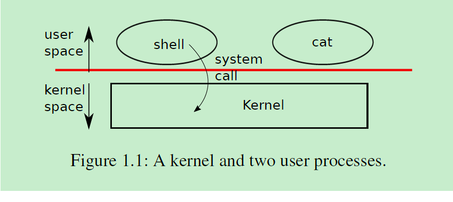
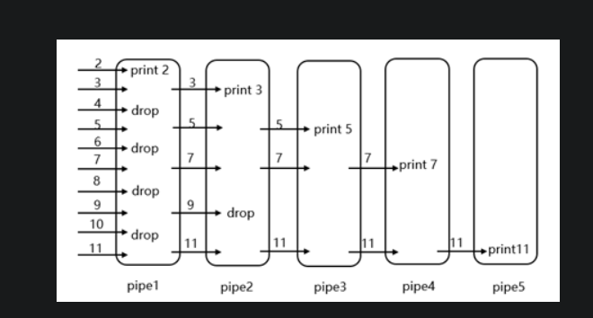

# Xv6 and Unix utilities - 20210415

以xv6作为具体例子来入门操作系统。

## Run

```sh
# build and run xv6
make qemu

# xv6 has no ps command; type ctrl-p, the kernel will print information about each process
ctrl-p

# To quit qemu
ctrl-a x

```
## 遗留问题

* fork()创建子程序后，子程序和父程序如何共享程序段的？
    参考代码 ./user/fork_test.c

## Core Concepts

### Kernel Space & User Space & System Call



### shell

The shell is an ordinary program, not part of the kernel, that reads commands from the user and executes them.  
The xv6 shell is a simple implementation of the essence of the Unix Bourne shell.   
Its implementation can be found at (user/sh.c:1).  

### process and memory

system call:  
    int fork()  
    Create a process, return child’s PID.  
    int exec(char *file, char *argv[])  
    Load a file and execute it with arguments; only returns if error.

### I/O and file descriptors(fd)

fd 提供了一层抽象，隐藏了（pipe, file, device ...）的细节；  

a process:   
    reads from file descriptor 0 (standard input),   
    writes output to file descriptor 1 (standard output), and  
    writes error messages to file descriptor 2 (standard error)  

system call：
    int write(int fd, char *buf, int n)  
    The call __write(fd, buf, n)__ writes n bytes from buf to the file descriptor fd and returns the number of bytes written.  
    int read(int fd, char *buf, int n)  
    The call __read(fd, buf, n)__ reads at most n bytes from the file descriptor fd, copies them into buf, and returns the number of bytes read.  

### pipes 

pipe提供了进程间通信的工具；  

重定向

### file system

inode - links  
The __fstat__ system call retrieves information from the inode   that a file descriptor refers to.  
It fills in a struct stat, defined in stat.h (kernel/stat.h) as:

```c
#define T_DIR       1   // Directory
#define T_FILE      2   // File
#define T_Device    3   // Device

struct stat {
    int dev;        // File system's disk device
    uint ino;       // Inode number
    short type;     // Type of file
    short nlink;    // Number of links to file
    uint645 size;   // Size of file in bytes
}
```

system call:
    int chdir(char *dir)  
    Change the current directory.

## Labs

### sleeps - easy

./user/sleep.c

### pingpong - easy

./user/pingpong.c

### primes - hard

./user/primes.c  
./user/primes_example.c



### find - moderate - ing
 
Look at user/ls.c to see how to read directories.  
./user/find.c  

### xargs - moderate - ing

./user/xargs.c